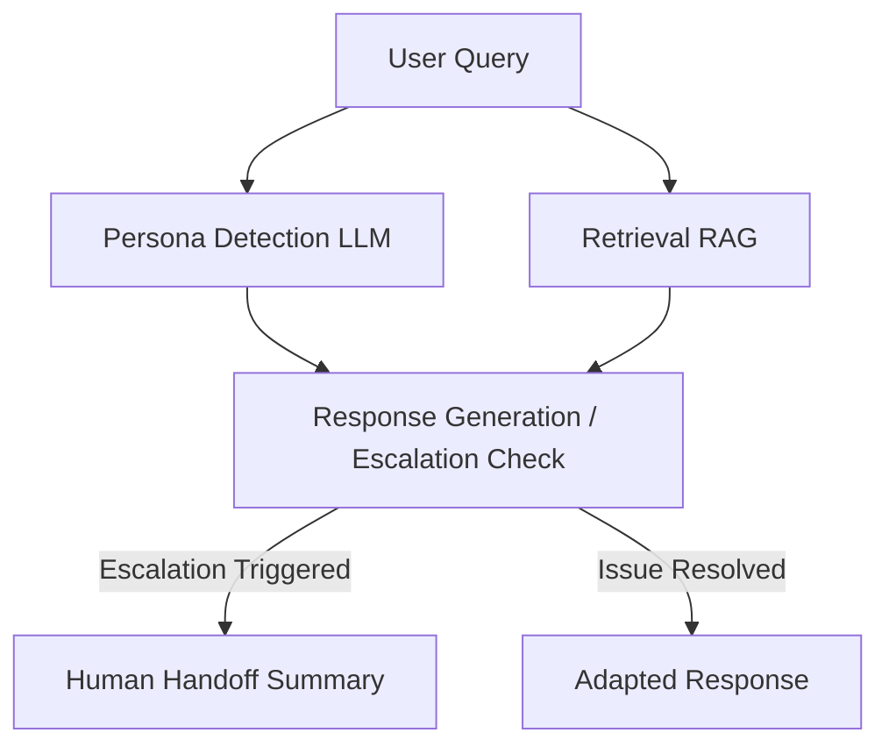

# Adsparkx AI - Persona-Adaptive Customer Support Agent

## Project Overview
This project is an intelligent customer support agent capable of adapting its responses based on the customer's persona. It classifies users into one of three personas (Technical Expert, Frustrated User, Business Executive), retrieves relevant information using a RAG (Retrieval-Augmented Generation) pipeline, generates a tailored response, and escalates complex or sensitive issues to a human agent along with a structured handoff summary.

## Tech Stack
- **Backend/UI:** Python 3.11, Streamlit (v1.32.2)
- **Agent Framework:** LangChain (v0.1.13)
- **LLM:** Google Gemini 1.5 Flash (via `langchain-google-genai` v1.0.1)
- **Embedding Model:** Sentence Transformers (`all-MiniLM-L6-v2`) via HuggingFace
- **Vector Database:** ChromaDB (v0.4.24)
- **Document Parsing:** PyPDF (v4.1.0)

## Architecture Diagram


## Persona Detection Strategy
**Classification Method:** We use a strict prompt to the Gemini LLM instructing it to classify the user's message into exactly one of the three personas.
**Prompt Design:** The system prompt defines the characteristics of each persona clearly (e.g., Technical Expert uses jargon, Frustrated User uses emotional language, Business Executive focuses on SLA/impact).
**Rules Used:**
- **Technical Expert:** Requests logs, APIs, root causes.
- **Frustrated User:** Emotional language, urgency, repeated complaints.
- **Business Executive:** Outcome-focused, business impact, concise.

## RAG Pipeline Design
**Chunking Strategy:** `RecursiveCharacterTextSplitter` with `chunk_size=500` and `chunk_overlap=100`. This ensures context window optimization while preserving full sentences and paragraphs.
**Embedding Model:** `all-MiniLM-L6-v2` from HuggingFace. It is lightweight, fast, and excellent for English semantic search, running entirely locally.
**Vector Database:** Local `ChromaDB` with a persistent directory (`chroma_db`).
**Retrieval Strategy:** Top-K dense retrieval (`k=3`) mapping to the most relevant chunks based on cosine similarity.

## Escalation Logic
The system automatically escalates to a human support agent under specific conditions:
1. **No relevant documentation found:** If the vector DB returns zero context or the LLM cannot confidently answer based on the context.
2. **Escalation Triggers (Configurable):** The user mentions billing, refunds, legal action, lawsuit, or explicitly asks for a human manager.
3. **Structured Handoff:** When escalation occurs, an LLM call generates a JSON summary detailing the persona, issue, attempted steps, documents used, and a recommendation.

## Setup Instructions
1. **Clone the repository.**
2. **Install dependencies:**
   ```bash
   pip install -r requirements.txt
   ```
3. **Set up Environment Variables:**
   Create a `.env` file in the root directory and add your Google Gemini API key:
   ```env
   GEMINI_API_KEY=your_actual_api_key_here
   ```
4. **Generate the Knowledge Base and Vector DB:**
   Run the data generation script to create mock documents, and then run ingest to build the vector DB.
   ```bash
   python generate_data.py
   python ingest.py
   ```
5. **Run the Streamlit Application:**
   ```bash
   streamlit run app.py
   ```

## Example Queries
1. **Technical Expert:** "Can you explain the API authentication failure, specifically how to handle 429 status codes, and provide error details?"
2. **Frustrated User:** "I've tried everything and nothing works! The app keeps crashing and I need it fixed immediately!"
3. **Business Executive:** "How does the recent downtime impact operations and what are our SLA service credit options?"
4. **Escalation Trigger:** "I want to cancel my account and get a refund because this service is terrible."
5. **Out of Scope (Escalation):** "What is the recipe for chocolate chip cookies?"

## Known Limitations & Future Improvements
- **Multi-turn Memory:** Currently, each query is treated as an independent request. Implementing a `ConversationBufferMemory` would allow the agent to track context across multiple turns.
- **Agentic Workflows:** Migrating from a basic LangChain Chain to LangGraph for a more robust multi-agent workflow (e.g., separating the Retriever Agent, the Responder Agent, and the Escalation Agent).
- **Sentiment Analysis:** Adding a dedicated NLP model for sentiment scoring to automatically escalate when anger reaches a specific threshold.
